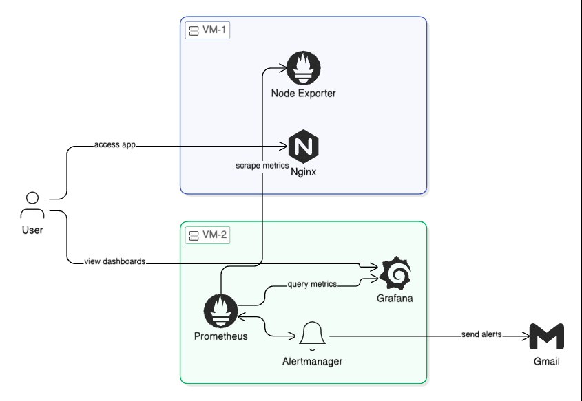

# 🔍 ProMonitor — Infrastructure Monitoring Stack

A production-style infrastructure monitoring solution built across **two Vagrant-managed virtual machines**. ProMonitor uses Prometheus, Grafana, Alertmanager, and Node Exporter to collect system metrics, visualize them on dashboards, and send real-time alerts via email.

---

## 📐 Architecture



The system is split across two VMs on a private network:

| Component             | VM   | IP Address      | Role                                                           |
| --------------------- | ---- | --------------- | -------------------------------------------------------------- |
| **Nginx**             | VM-1 | `192.168.25.10` | Web server — the application being monitored                   |
| **Node Exporter**     | VM-1 | `192.168.25.10` | Exposes hardware & OS metrics for Prometheus to scrape         |
| **Prometheus**        | VM-2 | `192.168.44.10` | Scrapes metrics from VM-1 and stores time-series data          |
| **Grafana**           | VM-2 | `192.168.44.10` | Queries Prometheus to render visual dashboards                 |
| **Alertmanager**      | VM-2 | `192.168.44.10` | Handles alerts fired by Prometheus and routes them to Gmail    |
| **Blackbox Exporter** | VM-2 | `192.168.44.10` | Probes endpoints (HTTP, TCP, etc.) for availability monitoring |

### How It Works

1. **User** accesses the web application served by **Nginx** on VM-1
2. **Prometheus** (VM-2) scrapes system metrics from **Node Exporter** (VM-1) and probes endpoints via **Blackbox Exporter**
3. **Grafana** (VM-2) queries Prometheus to display real-time dashboards — the user can view these directly
4. When alert conditions are met, Prometheus triggers the **Alertmanager**, which sends notifications to **Gmail**

---

## 🗂️ Project Structure

```
ProMonitor/
├── VM1/
│   └── Vagrantfile        # Provisions VM-1: Nginx + Node Exporter
├── VM2/
│   └── Vagrantfile        # Provisions VM-2: Prometheus + Alertmanager + Blackbox Exporter
├── architecture.png       # Architecture diagram
└── README.md
```

---

## ⚙️ Prerequisites

- [Vagrant](https://www.vagrantup.com/downloads) (≥ 2.3)
- [VirtualBox](https://www.virtualbox.org/wiki/Downloads) (≥ 6.1)
- At least **4 GB** of free RAM (each VM uses 2 GB)

---

## 🚀 Getting Started

### 1. Start VM-1 (Monitored Server)

```bash
cd VM1
vagrant up
```

This provisions an **Ubuntu 20.04** VM and installs:

- **Node Exporter v1.8.1** — exposes system metrics on port `9100`
- **Nginx** — web server accessible to the user

### 2. Start VM-2 (Monitoring Server)

```bash
cd VM2
vagrant up
```

This provisions an **Ubuntu 20.04** VM and installs:

- **Prometheus v2.52.0** — metrics collection engine (port `9090`)
- **Alertmanager v0.27.0** — alert routing & notification (port `9093`)
- **Blackbox Exporter v0.25.0** — endpoint probing (port `9115`)
- **Grafana** — dashboards & visualization (port `3000`)

### 3. Access the Services

| Service               | URL                                 |
| --------------------- | ----------------------------------- |
| Nginx (App)           | `http://192.168.25.10`              |
| Node Exporter Metrics | `http://192.168.25.10:9100/metrics` |
| Prometheus            | `http://192.168.44.10:9090`         |
| Grafana               | `http://192.168.44.10:3000`         |
| Alertmanager          | `http://192.168.44.10:9093`         |

---

## 📬 Alerting

Prometheus evaluates alert rules (e.g., instance down, high CPU usage) and forwards firing alerts to Alertmanager. Alertmanager then routes these notifications to a configured **Gmail** address.

> **Note:** You need to configure Alertmanager with your Gmail SMTP credentials and alert rules in Prometheus for email alerting to work.

---

## 🛠️ Tech Stack

| Tool              | Version   | Purpose                              |
| ----------------- | --------- | ------------------------------------ |
| Vagrant           | —         | VM provisioning & management         |
| VirtualBox        | —         | Virtualization provider              |
| Ubuntu            | 20.04 LTS | Base OS for both VMs                 |
| Nginx             | latest    | Web server (monitored target)        |
| Node Exporter     | 1.8.1     | System metrics exporter              |
| Prometheus        | 2.52.0    | Metrics collection & alerting engine |
| Alertmanager      | 0.27.0    | Alert routing & notifications        |
| Blackbox Exporter | 0.25.0    | Endpoint availability probing        |
| Grafana           | latest    | Metrics visualization & dashboards   |

---

## 📄 License

This project is open-source. Feel free to use and modify it for learning and production purposes.
